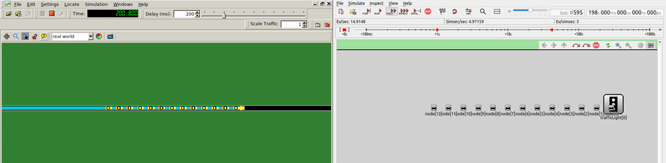
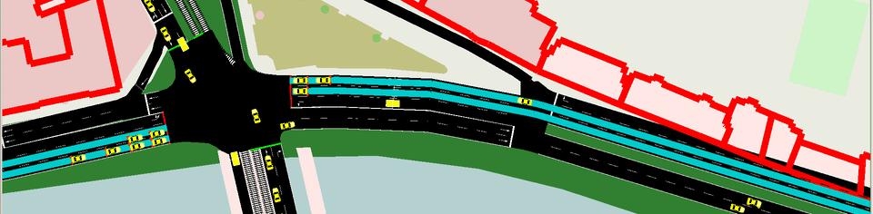

# QDP Veins

Queue discharge-based emergency vehicle traffic signal preemption simulation in Veins. 'QDP' stands for Queue Discharge-based Preemption.

## Content of this repository

This is an accompanying repository for the IFAC 2020 called Queue discharge-based emergency vehicle traffic signl preemption (<https://www.sciencedirect.com/science/article/pii/S240589632032629X>). The paper proposes a new approach of emergency vehicle preemption (setting traffic lights to green for EVs) based on the size of a queue of vehicles standing in front of a stopline of an intersection and a simple model of discharging of a queue. Find the citing information at the bottom of this page.


### OMNeT++ modules:
The following modules are implemented and can be found (NED files as well as C++ implementations) in `qdp_veins/src/qdp_veins`.
- QdpTrafficLightApp: application layer for traffic light controller. The algorithm to compute time to start preemption (T\_P) is implemented here.
- QdpTrafficLightLogic: module dealing with traffic light signal plans. This module executed the preemption phase after request from QdpTrafficLightApp.
- EmergencyAppl: application layer for emergency vehicle. It beacons position and speed every 1s.
- ForwarderAppl: application layer for public transport, RSUs or other ordinary cars to forward beacons sent by emergency vehicle.

### SUMO scenarios:
Files for SUMO can be found under `qdp_veins/examples/`.

#### discharge
Simplistic showcase of our preemption approach. Straight road with traffic light in the middle. RSU is used to extend the reach of beacons from emergency vehicle. In the GIF below you can see a view from SUMO on the left and a view from OMNeT++ on the right. An emergency vehicle arrives from the left side of the road and triggers preemption.


#### brno_por
Realistic scenario of one major intersection in the city of Brno, the Czech republic. This scenario includes traffic of other vehicles which was determined using induction loop measurements from the exact area. The example contains traffic for the whole weekday. In the GIF below you can see how does the simulation look like, there is an emergency vehicle coming from the east approach of the intersection and triggers a preemption program on the traffic lights. The experiment conducted in real traffic in the area of this example is documented in the following video: <https://youtu.be/WS80hyG2-rM>.


## How to run simulations ##

You need a working installation of OMNeT++ and SUMO. The easiest way would be to use Instant Veins (virtual machine with Veins installation, see <http://veins.car2x.org/documentation/instant-veins/>). Pull this repository into the virtual machine and import this repository as a project to OMNeT++ IDE. Then right-click on the `omnetpp.ini` file from selected example and pick 'Run as' -> 'OMNeT++ Simulation'. For more information, please consult Veins, OMNeT++ and SUMO documentations and tutorials.

### Supported program versions ###
The repository was started using Cookiecutter for Veins (see <https://github.com/veins/cookiecutter-veins-project>). 

- Veins 5.0 (see <http://veins.car2x.org/>)
- OMNeT++ 5.5.1 (see <https://omnetpp.org/>)
- SUMO 1.4.0 (see <https://sumo.dlr.de/docs/>), tested with 1.5.0 and it should work also with 1.6.0

### Modifications to scenarios ###
You can change some settings to see different simulation runs:

#### discharge
1) set different `number` of cars in the queue in `qdp_veins/examples/discharge/discharge.rou.xml`
```xml
<flow id="flow0" type="PASSENGER_MOD" route="route0" begin="0" period="0.1" number="13" departSpeed="max"/>
```

#### brno_por
1) change time of `depart` of emergency vehicle to different time of the day. Change must be reflected in `qdp_veins/examples/brno_por/emergency.rou.xml`:
```xml
<!-- 25500s = 7:05 AM -->
<vehicle id="emergency_01" type="EMERGENCY_AMB" depart="25500" departSpeed="max" route="ev_route_west_to_east"/>
```
You should also change the simulation start and end in `qdp_veins/examples/brno_por/omnetpp.ini`. Sensible setting is to start 5 minutes before the departure and end 5 minutes after:
```
*.manager.firstStepAt = 25200s
sim-time-limit = 25800s 
```
2) road of emergency vehicle. There are two roads available. Setting must be in `qdp_veins/examples/brno_por/emergency.rou.xml`: 
```xml
<!-- 25500s = 7:05 AM -->
<!-- <vehicle id="emergency_01" type="EMERGENCY_AMB" depart="25500" departSpeed="max" route="ev_route_west_to_east"/>-->
<!-- The direction east_to_west can be seen in the YouTube video linked above and also in the gif-->
<vehicle id="emergency_02" type="EMERGENCY_AMB" depart="25500" departSpeed="max" route="ev_route_east_to_west"/>
```
and in `qdp_veins/examples/brno_por/omnetpp.ini`:
```
### For emergency vehicle to approach from the West side:
#*.trafficLight[*].appl.approachRoadID = "gneE41"
#*.trafficLight[*].appl.approachDetIDs = "2_06_e2_west_0 2_06_e2_west_1"  # two detectors

### For emergency vehicle to approach from the East side:
*.trafficLight[*].appl.approachRoadID = "-4463914#2"
*.trafficLight[*].appl.approachDetIDs = "2_06_e2_east_0 2_06_e2_east_1"  # two detectors

```

#### both
you might want to try with different `desired_speed` of emergency vehicle (or v_op in publication). Change in `qdp_veins/src/qdp_veins/QdpAlgorithmCalculation.h`:
```c++
const double desired_speed = 70/3.6;    // desired speed of emergency vehicle [m/s]
```


### Bibtex info
If you use this code, please cite the paper as:

'''
@article{obrusnik_queue_2020,
	series = {21th {IFAC} {World} {Congress}},
	title = {Queue discharge-based emergency vehicle traffic signal preemption⁎⁎{The} research was funded by {Technology} {Agency} of the {Czech} {Republic} within the program {Epsilon}, the project {TH03010155}.},
	volume = {53},
	issn = {2405-8963},
	url = {https://www.sciencedirect.com/science/article/pii/S240589632032629X},
	doi = {10.1016/j.ifacol.2020.12.1998},
	abstract = {In this paper, we document a novel method for emergency vehicle preemption at an intersection controlled by traffic lights. The method relies on wireless vehicle-to-infrastructure (V2I) communication between the emergency vehicle and the traffic lights controller, availability of an accurate estimate of the number of vehicles in the queue, and a mathematical model of dynamics of discharging of the queue. Unlike some occasionally deployed methods that trigger the preemption the instant that the emergency vehicle appears at a prespecified distance from the intersection, the proposed method adapts the activation moment to the actual traffic conditions so that the preemption is as short as possible, thus reducing the impact on the other traffic. The method has been finetuned using numerical simulations in SUMO simulator and experimentally verified in real urban traffic.},
	language = {en},
	number = {2},
	urldate = {2021-04-25},
	journal = {IFAC-PapersOnLine},
	author = {Obrusník, Vít and Herman, Ivo and Hurák, Zdeněk},
	month = jan,
	year = {2020},
	keywords = {emergency vehicle preemption, intelligent transportation systems, queue modelling, traffic control},
	pages = {14997--15002}
}
'''
